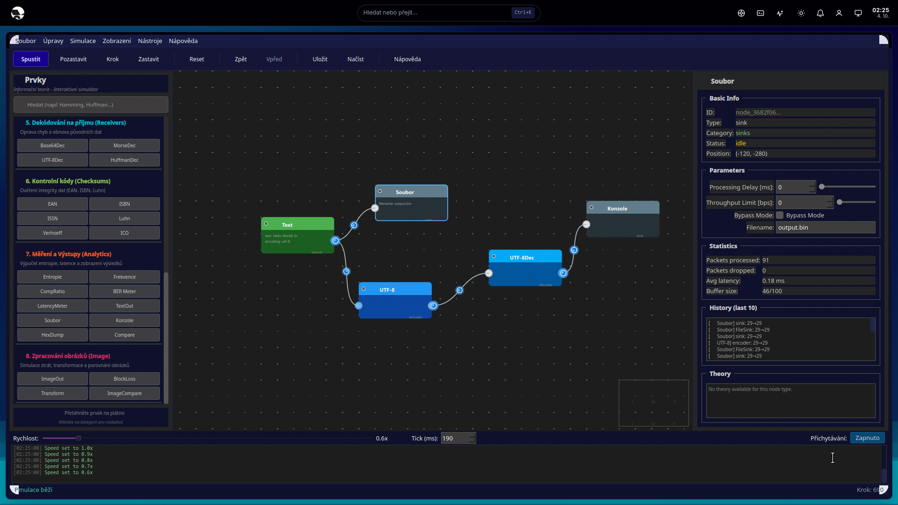

# InfoFlowLab

**InfoFlowLab** je interaktivní simulátor komprese a komunikace pro vizuální návrh a testování datových toků. Aplikace umožňuje uživatelům vytvářet grafy z uzlů (nodes), propojovat je a simulovat přenos dat v reálném čase.




## Otevřená webová kniha

**InfoFlowLab je kanonická hloubka** pro teorii informace a cvičení. Webová kniha algoritmy **nepřepisuje** — má jen rozcestník:

*InfoFlowLab — rozcestník (ne učebnice)* — související webová kniha je vedena jako samostatný projekt.

## 🎯 Účel

InfoFlowLab je navržen pro:
- **Vzdělávací účely** - Studenti informačních systémů a teorie přenosu informací
- **Vizualizaci datových toků** - Interaktivní návrh komunikačních řetězců
- **Testování algoritmů** - Komprese, kódování, ECC, kontrolní součty
- **Simulaci komunikace** - Kanály se šumem, zpožděním, ztrátami

## ✨ Hlavní funkce

### 🎨 Vizuální editor
- **Drag & Drop** - Přetahování uzlů ze sidebaru na canvas
- **Propojování portů** - Klikněte na port a táhněte k jinému portu
- **Zoom a posun** - Ctrl+Scroll pro zoom, middle mouse pro posun
- **Automatické mazání** - Delete/Backspace pro smazání vybraného prvku

### 🔧 Simulace
- **Režimy simulace**:
  - ▶️ **Real-time** - Spuštění v reálném čase
  - ⏸️ **Pause/Resume** - Pozastavení a pokračování
  - ⏭️ **Step** - Krok po kroku pro vzdělávací účely
- **Nastavitelná rychlost** - 0.1x až 5.0x
- **Tick interval** - 10ms až 1000ms
- **Injektování paketů** - Ruční vložení testovacích dat

### 📦 Kategorie uzlů (30+ typů)

#### 📝 Zdroje (Sources)
- **TextSource** - Vstup textu
- **RandomSource** - Náhodná data s nastavitelnou entropií
- **NumberInput** - Číselné hodnoty v různých soustavách

#### 🔀 Kódování (Encoders)
- **Base64** - Base64 kódování/dekódování
- **Hex** - Hexadecimální převod
- **BaseConverter** - Převod mezi číslenými soustavami
- **UTF-8** - UTF-8 kódování
- **Morse** - Morseova abeceda
- **Huffman** - Huffmanovo kódování

#### 🗜️ Komprese (Compressors)
- **Huffman** - Huffmanova komprese
- **RLE** - Run-Length Encoding

#### 📡 Kanály (Channels)
- **BSK** - Binární symetrický kanál se šumem
- **Ideal** - Ideální kanál se zpožděním

#### 🔴 ECC (Error Correction)
- **Hamming(7,4)** - Hammingův kód pro opravu 1-bitových chyb
- **CRC32** - CRC kontrolní součet

#### ✅ Kontrolní součty (Checksums)
- **EAN-13** - Validace EAN-13 čárových kódů
- **ISBN** - Validace ISBN-10/13
- **ISSN** - Validace ISSN
- **Luhn** - Luhnův algoritmus (kreditní karty)
- **Verhoeff** - Verhoeffův algoritmus

#### 📊 Analyzátory (Analyzers)
- **EntropyMeter** - Výpočet Shannonovy entropie
- **Histogram** - Analýza frekvence znaků

#### 💾 Výstupy (Sinks)
- **Console** - Výstup do konzole
- **File** - Uložení do souboru
- **HexDump** - Hexadecimální výpis
- **TextOutput** - Textový výstup

### 🎛️ Nástroje
- **Console** - Barevný výpis logů s časovým razítkem
- **Inspector** - Panel vlastností vybraného uzlu
- **Profiling** - Výkonnostní profilování
- **Save/Load** - Ukládání a načítání scénářů (JSON)

## 🚀 Rychlý start

### Požadavky

- Python 3.8 nebo vyšší
- PySide6 6.5.0 nebo vyšší

### Instalace

```bash
# Klonování repozitáře
git clone https://github.com/pauliquib/infoflowlab.git
cd infoflowlab

# Instalace závislostí
pip install -e .

# nebo s vývojovými závislostmi
pip install -e ".[dev]"

# nebo se všemi závislostmi
pip install -e ".[full]"
```

### Spuštění

```bash
# Přímé spuštění
python main.py

# nebo pomocí Makefile
make run
```

## 🧪 Testování

```bash
# Spuštění všech testů
make test

# nebo přímo s pytest
pytest tests/ -v

# S pokrytím kódu
make test-cov

# Pouze unit testy
make test-unit
```

## 📚 Použití

### Základní práce s aplikací

1. **Vytvoření uzlu**: Přetáhněte prvek ze sidebaru na canvas
2. **Propojení**: Klikněte na výstupní port (vpravo) a táhněte k vstupnímu portu (vlevo)
3. **Konfigurace**: Klikněte na uzel pro zobrazení vlastností v Inspectoru
4. **Simulace**: Klikněte na ▶️ Play pro spuštění simulace
5. **Krokování**: Použijte ⏭️ Step pro krok po kroku

### Klávesové zkratky

| Klávesa | Akce |
|---------|------|
| `Delete` / `Backspace` | Smazat vybraný prvek |
| `Escape` | Zrušit propojování |
| `Ctrl + Scroll` | Zoom in/out |
| `Middle Mouse` | Posun plátna |

### Ukládání a načítání

```python
from src.utils.serialization import export_scenario, import_scenario

# Uložení scénáře
export_scenario(engine, "moj_scenar.json", "Můj scénář")

# Načtení scénáře
engine = import_scenario("moj_scenar.json")
```

## 🏗️ Architektura

```
┌─────────────────────────────────────────┐
│  GUI vrstva (src/gui/)                  │
│  - MainWindow, Canvas, Sidebar, Inspector│
├─────────────────────────────────────────┤
│  Node vrstva (src/nodes/)               │
│  - Konkrétní implementace uzlů          │
├─────────────────────────────────────────┤
│  Algoritmy (src/algorithms/)            │
│  - Entropie, Huffman, Hamming, CRC...   │
├─────────────────────────────────────────┤
│  Core vrstva (src/core/)                │
│  - Graph, Engine, NodeBase, Port, Packet │
├─────────────────────────────────────────┤
│  Utils (src/utils/)                     │
│  - Serializace, Logging                  │
└─────────────────────────────────────────┘
```

### Klíčové komponenty

- **Graph** - Centrální úložiště grafu, spravuje uzly a spojení
- **SimulationEngine** - Řídí simulaci datového toku
- **NodeBase** - Základní třída pro všechny uzly
- **DataPacket** - Datová struktura pro přenos informací
- **Canvas** - Vizuální plátno pro úpravu grafu

## 🛠️ Vývoj

### Struktura projektu

```
infoflowlab/
├── src/
│   ├── core/           # Jádro systému
│   │   ├── graph.py
│   │   ├── engine.py
│   │   ├── node_base.py
│   │   ├── port.py
│   │   └── packet.py
│   ├── nodes/          # Implementace uzlů
│   │   ├── sources.py
│   │   ├── encoders.py
│   │   ├── compressors.py
│   │   ├── channels.py
│   │   ├── ecc.py
│   │   ├── checksums.py
│   │   ├── analyzers.py
│   │   └── sinks.py
│   ├── algorithms/     # Algoritmy
│   │   ├── entropy.py
│   │   ├── huffman.py
│   │   ├── hamming.py
│   │   ├── checksums.py
│   │   └── ...
│   ├── gui/            # GUI komponenty
│   │   ├── main_window.py
│   │   ├── canvas.py
│   │   ├── sidebar.py
│   │   └── inspector.py
│   └── utils/          # Pomocné nástroje
│       ├── serialization.py
│       └── logger.py
├── tests/              # Test suite
├── docs/               # Dokumentace
├── logs/               # Logy
└── assets/             # Ikony a obrázky
```

### Přidání nového uzlu

1. Vytvořte třídu v `src/nodes/kategorie.py`:
```python
class MyNode(NodeBase):
    def __init__(self, node_id: str):
        super().__init__(node_id, "category", "Název")
        self.add_input("in")
        self.add_output("out")
    
    def process(self, packet: DataPacket, input_port: str) -> DataPacket:
        # Implementace
        return new_packet
```

2. Přidejte do `src/nodes/__init__.py`

3. Přidejte do `Canvas.add_node_at()` v `src/gui/canvas.py`

### Dostupné příkazy

```bash
make help          # Zobrazí všechny dostupné příkazy
make install       # Instalace balíčku
make install-dev   # Instalace s vývojovými závislostmi
make test          # Spuštění testů
make lint          # Kontrola kódu (flake8)
make format        # Formátování kódu (black)
make typecheck     # Kontrola typů (mypy)
make clean         # Vyčištění projektu
```

## 📖 Dokumentace

- [Přehled projektu](docs/actualni_rozpracovanost.md)
- [Architektura spojení](docs/CONNECTION_SYSTEM_ARCHITECTURE.md)
- [Simulační engine](docs/SIMULATION_ENGINE_ARCHITECTURE.md)
- [Nápověda k propojování](docs/NAPOVEDA_PROPOJENI.md)
- [Logování a profilování](docs/logging_profiling.md)

## 🐛 Známé problémy

- Porty jsou malé (16px) - může být obtížné trefit
- Animace paketů je lineární (ne po Bézierově křivce)
- Chybí undo/redo funkce
- Chybí export do PDF

## 🔮 Plánované vylepšení

### Krátkodobé (1-2 týdny)
- [ ] Undo/Redo pro akce na canvasu
- [ ] Lepší detekce portů (zvětšit hit area)
- [ ] Export grafu do obrázku
- [ ] Zoom to fit

### Střednědobé (1-2 měsíce)
- [ ] Více typů uzlů
- [ ] Plugin systém pro uživatelské uzly
- [ ] Batch simulace
- [ ] Statistiky a reporty

### Dlouhodobé (3+ měsíce)
- [ ] Webová verze (WebAssembly)
- [ ] Sdílení grafů (cloud)
- [ ] Pokročilé vizualizace

## 🤝 Přispění

Příspěvky jsou vítány! Prosím:

1. Forkněte repozitář
2. Vytvořte feature branch (`git checkout -b feature/AmazingFeature`)
3. Commitujte změny (`git commit -m 'Add AmazingFeature'`)
4. Pushněte do branch (`git push origin feature/AmazingFeature`)
5. Otevřete Pull Request

## 📝 Licence

Tento projekt je licencován pod MIT licencí - viz soubor [LICENSE](LICENSE) pro detaily.

## 👥 Autoři

- **pauliquib** - *První verze*

## 📞 Kontakt

Pokud máte otázky nebo návrhy, otevřete prosím issue na GitHubu.

---

**InfoFlowLab v1.0** - Vytvořeno s ❤️ pro vzdělávání